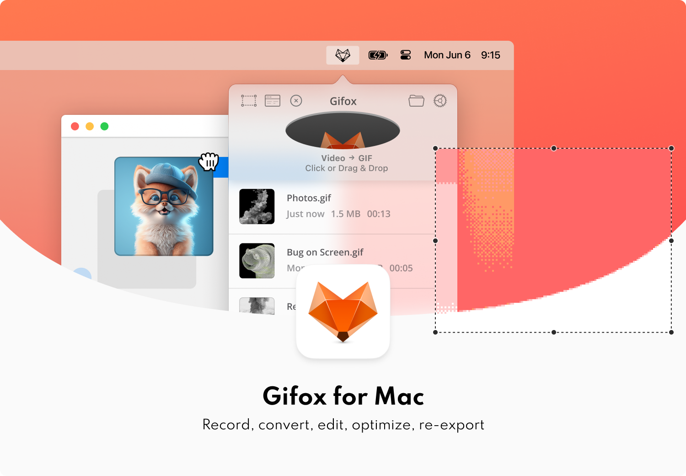

This is the issue and feedback tracking repository for [Gifox](https://gifox.io) – a menu bar app that records your screen into animated GIFs.

Issues are difficult to fix if we can’t reproduce them on our end. When something isn’t working as expected it helps to include the app logs – the easiest way to do that is using the in-app contact form, or to tell us:

- What did you try to do and what steps did you take to do that?
- What did you expect to happen and what happened instead?

If you’d like to follow what’s going on you can [subscribe](https://gifox.io/subscribe) for an occasional newsletter or [follow us](https://twitter.com/gifoxapp) on Twitter!

✌️
